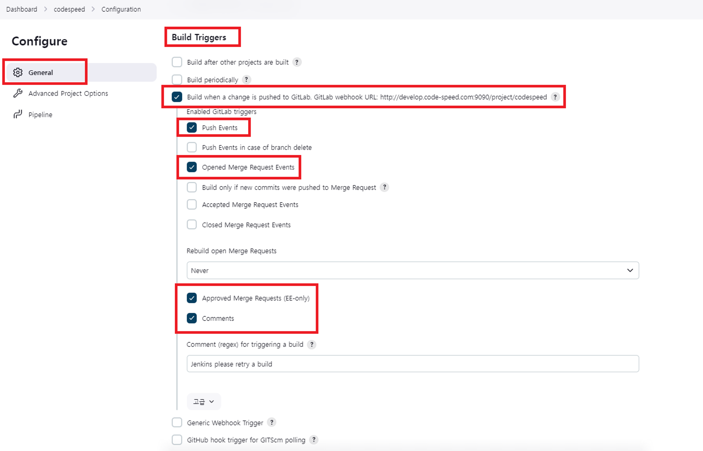
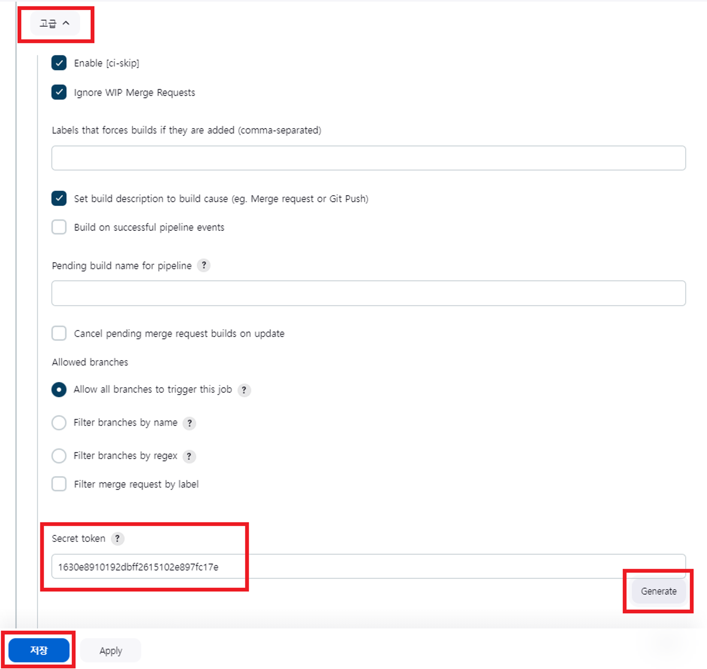
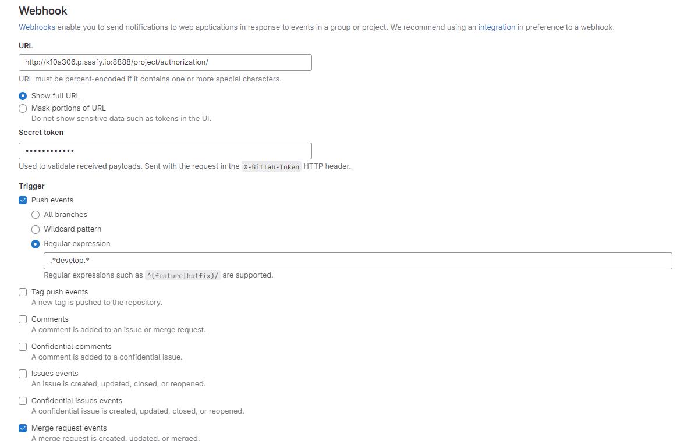
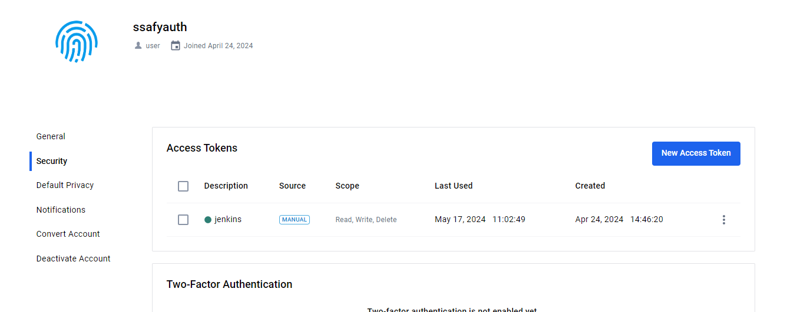
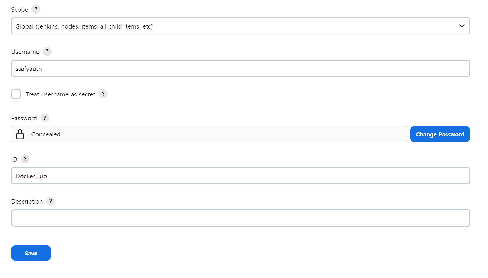
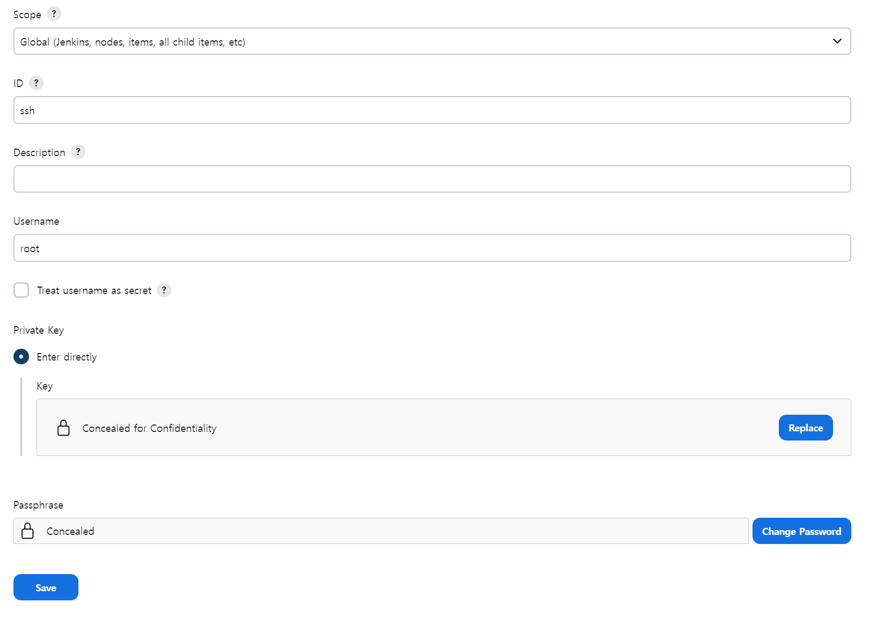
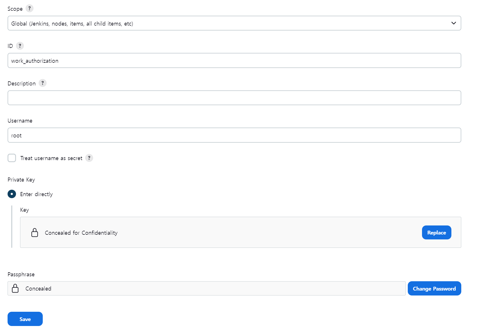

# SSAFY AUTH 포팅 메뉴얼


`SSAFY AUTH` 서비스의 빌드 및 배포를 위한 문서입니다.

## 목차

### 1. 개발 환경

### 2. 서비스 아키텍처

### 3. 배포 환경 구축

### 4. CI/CD

## 1. 개발 환경

- Front-End

|      Tech      |   Version   |
| :------------: | :---------: |
|      thymeleaf      |   0    |


- Back-End

|    Tech     | Version |
| :---------: | :-----: |
|    Java     |   21    |
| Spring Boot |  3.2.3  |
|   gradle    |   8.5   |
|   postgresql   |  0.0.0  |
|    Redis    |  0.0.0  |
|    elasticsearch    |  5.2.5  |


## 2. 서비스 아키텍처


## 3. 배포 환경 구축

### Docker 설치

- Docker 설치 전 필요한 패키지 설치

```
sudo apt-get -y install apt-transport-https ca-certificates curl gnupg-agent software-properties-common
```

- Docker에 대한 GPC Key 인증 진행

```
curl -fsSL https://download.docker.com/linux/ubuntu/gpg | sudo apt-key add -
```

- Docker 레포지토리 등록

```
sudo add-apt-repository "deb [arch=amd64] https://download.docker.com/linux/ubuntu $(lsb_release -cs) stable"
```

- 패키지 리스트 갱신

```
sudo apt-get -y update
```

- Docker 패키지 설치
  - docker-ce: Docker Community Edition의 약자
  - docker-ce-cli: Docker Community Edition의 CLI 환경에서 추가로 설치해야 하는 패키지
  - [containerd.io](http://containerd.io): Docker 컨테이너 런타임

```
sudo apt-get -y install docker-ce docker-ce-cli containerd.io
```

- Docker 일반 유저에게 권한 부여Docker 일반 유저에게 권한 부여(sudo 없이 명령어 사용 가능)

```
sudo usermod -aG docker ubuntu
```

- Docker 서비스 재시작(사용자 세션 재로그인 필요)

```
sudo service docker restart
```

### Jenkins 설치(DinD 방식)

- Jenkins 이미지 받기(Java 21)

```
docker pull jenkins/jenkins:jdk21
```

- Jenkins 컨테이너 실행

```
docker run -d --restart always --env JENKINS_OPTS=--httpPort=8888 -v /etc/localtime:/etc/localtime:ro -e TZ=Asia/Seoul -p 8888:8080 -v /jenkins:/var/jenkins_home -v /var/run/docker.sock:/var/run/docker.sock --name jenkins -u root jenkins/jenkins:jdk21
```

- Jenkins 컨테이너 종료

```
sudo docker stop jenkins
```

- Jenkins 컨테이너 재시작

```
sudo docker restart jenkins
```

- Jenkins 접속 후 비밀번호 입력

```
# 1. log로 확인(시간이 지나면 뭍힘)
docker logs [jenkins container name]

# 2. /var/jenkins_home/secrets/initialAdminPassword 경로 확인
# Jenkins 컨테이너 접속
docker exec -it jenkins /bin/bash

# 경로 이동
cd /var/jenkins_home/authorization
cd /var/jenkins_home/client
cd /var/jenkins_home/resource-server

# 확인
cat initialAdminPassword
```

- Jenkins 접속 후 추천 플러그인 설치 및 기타 설정

- Jenkins 컨테이너 접속 후 Docker Repository 등록 및 docker-ce 패키지 설치

```
docker exec -it jenkins /bin/bash

apt-get update && apt-get -y install apt-transport-https ca-certificates curl gnupg2 software-properties-common && curl -fsSL https://download.docker.com/linux/$(. /etc/os-release; echo "$ID")/gpg > /tmp/dkey; apt-key add /tmp/dkey && add-apt-repository "deb [arch=amd64] https://download.docker.com/linux/$(. /etc/os-release; echo "$ID") $(lsb_release -cs) stable" && apt-get update && apt-get -y install docker-ce
```

- Docker Jenkins에서 Host Docker 접근권한 부여

```
groupadd -f docker
usermod -aG docker jenkins
chown root:docker /var/run/docker.sock
```

- Jenkins 플러그인 설치

```
# ssh 커맨드 입력에 사용
SSH Agent

# docker 이미지 생성에 사용
Docker
Docker Commons
Docker Pipeline
Docker API

# 웹훅을 통해 브랜치 merge request 이벤트 발생시 Jenkins 자동 빌드에 사용
Generic Webhook Trigger

# 타사 레포지토리 이용시 사용 (GitLab, Github 등)
GitLab
GitLab API
GitLab Authentication
GitHub Authentication

# Node.js 빌드시 사용
NodeJS

# 웹훅을 감지하고 Jenkins 작업을 트리거하는 데 사용
Generic Webhook Trigger
```

### nginx 설치(with https)

- Certbot 실행

```

```

- default.conf(/etc/nginx/default.conf)

```

```

- nginx 실행

```
sudo service nginx start
```

### PostgreSQL 설치

- PostgreSQL 컨테이너 실행


### Elasticsearch 설치

- Elasticsearch 컨테이너 실행


### Redis 설치

- Redis 컨테이너 실행

```
docker run -d --restart always -p 6379:6379 --name redis redis
```

## 4. CI/CD

### Web hook 설정

- Jenkins Job Build Triggers 설정



- Secret token 발행



- Gitlab Webhook 지정



### Docker Hub

- Dokcerhub Access Token 발행 및 레파지토리 생성



- Jenkins/Credentials 등록



### Ubuntu Credential

- Jenkins/Credentials 등록



- \*.pem 내용



### manager server 배포

- Dockerfile

```

```

- Jenkins Pipeline Script

```

```

- Jenkins 환경 변수(Jenkins/System)

```

```


### authorization server 배포

- yml(Jenkins/Credentials)

  - application.yml

  ```

  ```

  - application-oauth.yml

  ```
  
  ```

  - application-jwt.yml

  ```

  ```

- Dockerfile

```

```

- Jenkins Pipeline Script

```

```

### resource server 배포

- Dockerfile

```

```

- Jenkins Pipeline Script

```

```


